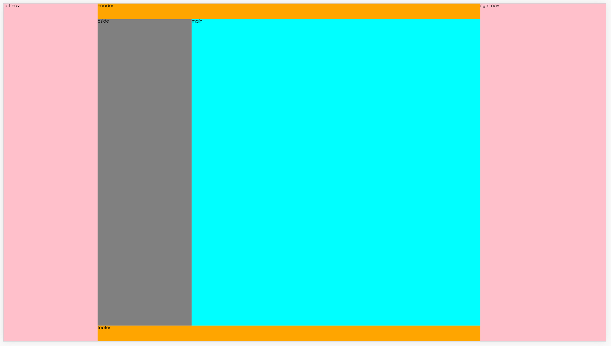
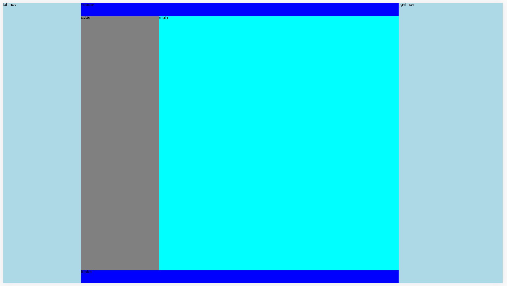

# homework-04 layout

---

### pos-abs

##### style-pos-abs.less

```css
html, body
{
    widows: 100%;
    height: 100%;
    margin: 0;
    padding: 0;
}

*
{
    box-sizing: border-box;
}

body
{
    font-size: 14px;
}

@left-nav-width: 300px;
@right-nav-width: 400px;
@header-height: 50px;
@footer-height: 50px;
@aside-width: 300px;

.app
{
    height: 100%;
    position: relative;

    > *
    {
        position: absolute;
        top: 0;
        bottom: 0;
    }

    > nav
    {
        background: pink;

        &.left
        {
            left: 0;
            width: @left-nav-width;
        }

        &.right
        {
            right: 0;
            width: @right-nav-width;
        }
    }

    > .container
    {
        left: @left-nav-width;
        right: @right-nav-width;

        > *
        {
            position: absolute;
            left: 0;
            right: 0;
        }

        > header
        {
            top: 0;
            height: @header-height;
            background: orange;
        }

        > .content
        {
            top: @header-height;
            bottom: @footer-height;

            > *
            {
                position: absolute;
                top: 0;
                bottom: 0;
            }

            > aside
            {
                left: 0;
                width: @aside-width;
                background: gray;
            }

            > main
            {
                left: @aside-width;
                right: 0;
                background: cyan;
            }
        }

        > footer
        {
            bottom: 0;
            height: @footer-height;
            background: orange;
        }
    }
}

```

##### 截图




---

### flex

##### style-flex.less

```css
html, body
{
    widows: 100%;
    height: 100%;
    margin: 0;
    padding: 0;
}

*
{
    box-sizing: border-box;
}

body
{
    font-size: 14px;
}

@left-nav-width: 300px;
@right-nav-width: 400px;
@header-height: 50px;
@footer-height: 50px;
@aside-width: 300px;

.app
{
    display: flex;
    height: 100%;

    > nav
    {
        background: lightBlue;

        &.left
        {
            width: @left-nav-width;
        }

        &.right
        {
            width: @right-nav-width;
        }
    }

    > .container
    {
        flex: 1;
        display: flex;
        flex-direction: column;

        > header
        {
            height: @header-height;
            background: blue;
        }

        > .content
        {
            flex: 1;
            display: flex;

            > aside
            {
                width: @aside-width;
                background: gray;
            }

            > main
            {
                background: cyan;
                flex: 1;
            }
        }

        > footer
        {
            height: @footer-height;
            background: blue;
        }
    }
}

```

##### 截图


